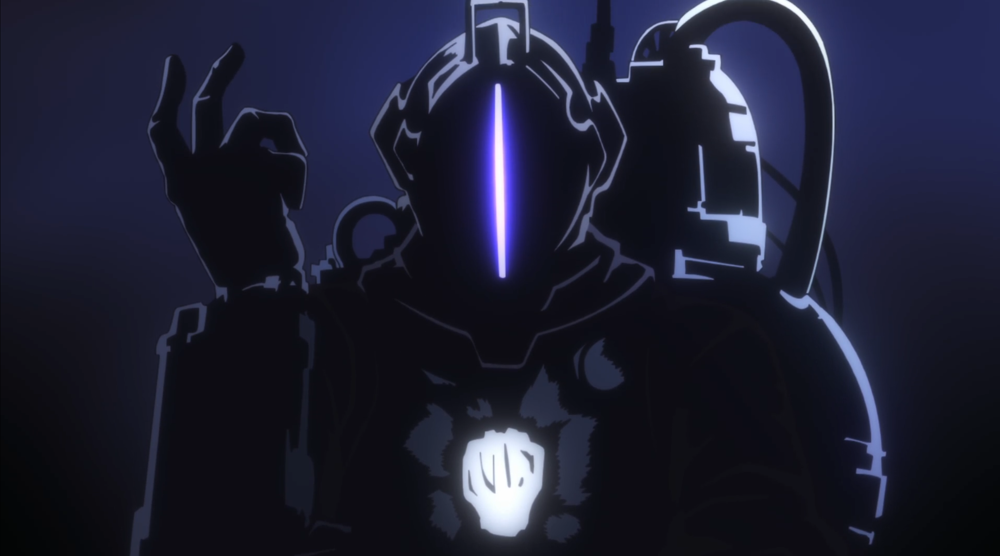

​

# デスノート.
​

\
\
この記録は私がキラ事件に関して調べてきたものの全てである。

これが人の目に触れているということは既に私はこの世にいないであろう。

私が残した確固たる成果とし、ここに記す。
\
\
​

\
\
\
\
\
\
\
\
\
\
\
\
\
\
\
\
\
\
\
\
\
\
\
\
\
\
\
\
\
\
\
\
\
\
\
\
\
\
​
__________________
​​
# ダンダダン.
\
​

 
 
 
 
 

 

 
 
 
 
 
 

 
 
 
 
 
 
 
 
 
 
 
 
 
 
 
 
 
 
 
 

\
\
\
\
\
\
\
\
\
\
\
\
\
\
\
\
\
\
\
\
\
\
\
\
\
\
\
\
\
\
\
\
\
\
\
\
\
\
​
__________________
​
# 天国大魔境.
\
​
感情も妄想も、

もはや意味をなさないな、崩れた街がにやつく。
\
\
\
 
 
 
 
 
 
 
 
 
 
 
 
 
 
 
 
 
 
 
 
 
 
 
 
 
 
 
 

\
\
判断も葛藤も、

もはや意味をなさないな、崩れた街がにやつく。
\
\
\
\
\
\
\
\
\
\
\
\
\
\
\
\
\
\
\
\
\
\
\
\
\
\
\
\
\
\
\
\
\
\
\
\
\
​
__________________
​
# 推しの子.
\
​
 
 
 
 
 
 
 
 
 
 
 
 
 
 
 
 
 
 
 
 
 
 
 
 
 
 
 
 
 

\
\
\
\
\
\
\
\
\
\
\
\
\
\
\
\
\
\
\
\
\
\
\
\
\
\
\
\
\
\
\
\
\
\
\
\
\
\
​
__________________
​
# メイドインアビス.
\
​
 
 
 
 
 
 
 
 
 
 
 
 
 
 
 
 
 
 
 
 
 
 
 
 
 
 
 
 
 
 
 
 
 
 
 
 
 
 

\
\
\
\
\
\
\
\
\
\
\
\
\
\
\
\
\
\
\
\
\
\
\
\
\
\
\
\
\
\
\
\
\
\
\
\
\
\
​
__________________

​
# チ。―地球の運動について―
\
でもこの未来は好都合に光ってる

だから進むんだ

今何光年も遠く 遠く 遠く叫んで

また怪獣になるんだ。
\
\
\
\
\
\
\
\
\
\
\
\
\
\
\
\
\
\
\
\
\
\
\
\
\
\
\
\
\
\
\
\
\
\
\
\
\
\
​
__________________

​
# 進撃の巨人.
\
The imposed absurdity in life is the beginning of the onslaught.

The stolen slands, the world itself as エレン of that day desires.

As unstoppable rage penetrates him.

To the dusk, he brings violet skies The bow and arrow of Hell.

