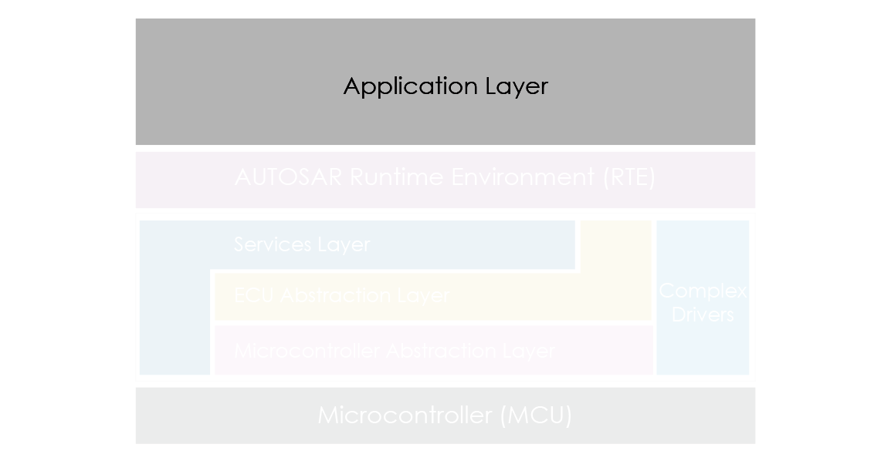
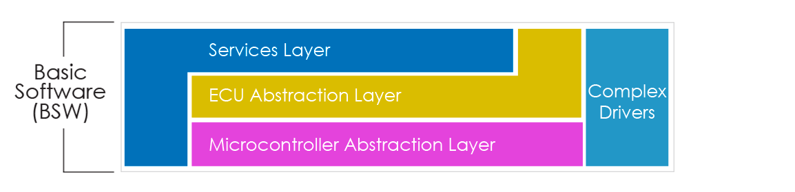
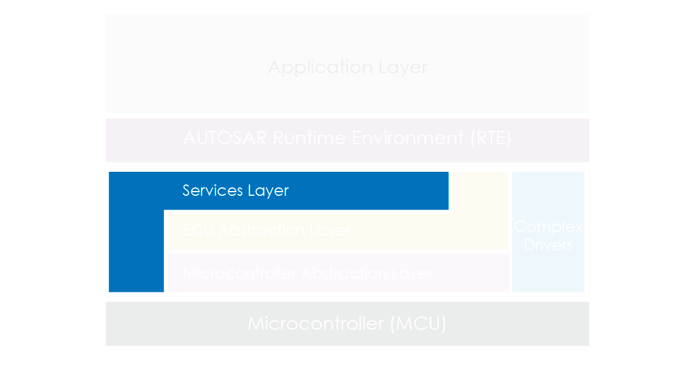
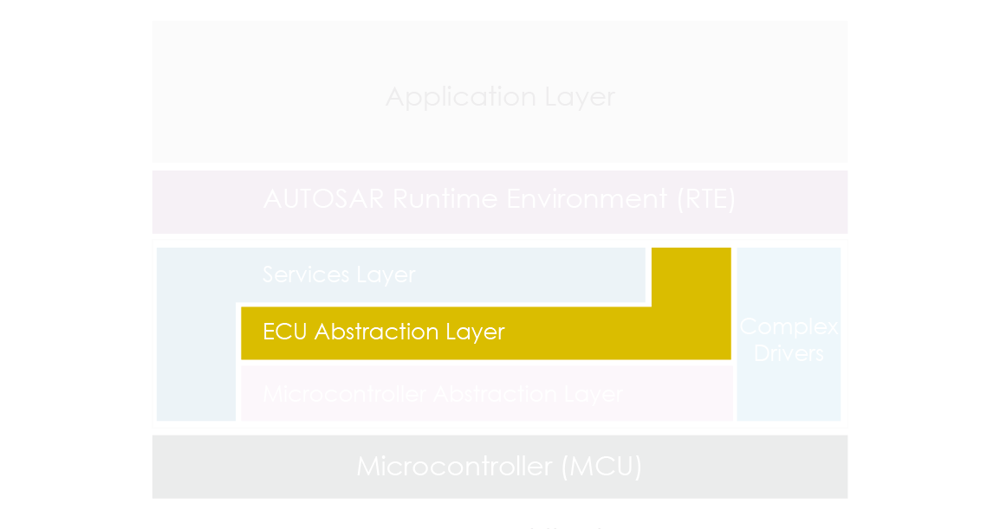
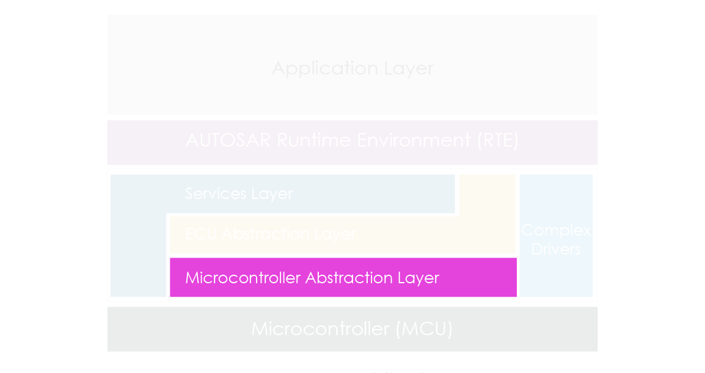
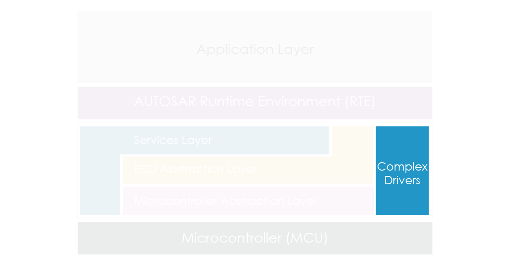
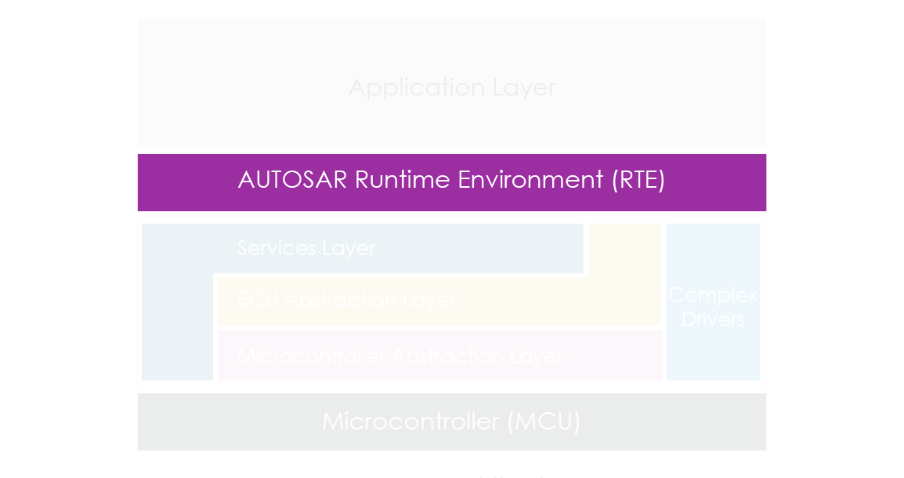

​
## Giới thiệu
​
AUTOSAR có vẻ khá xa lạ đối với người làm về công nghệ thông tin, nhưng đối với những bạn làm về Embedded System, đặc biệt là trong lĩnh vực Automotive, thì cũng... xa lạ nốt. 

Dạo một vòng trên Google, mình thấy tài liệu về AUTOSAR bằng tiếng Anh rất chi là hàn lâm, còn tiếng Việt thì hầu như không có. Theo dòng sự kiện **MayFest2023**, mình muốn chia sẻ chút kiến thức ít ỏi mà mình nghe lén được khi vẫn còn ăn bám ở công ty.

**AUTOSAR** (**AUT**omotive **O**pen **S**ystem **AR**chitecture) là một kiến trúc phần mềm được tiêu chuẩn hóa dùng để thiết kế ECU trong ngành công nghiệp Automotive. Nhưng, tiêu chuẩn là tiêu chuẩn gì, tiêu chuẩn hóa như thế nào và tiêu chuẩn đó nằm ở đâu trên một chiếc ô tô ? 

Lấy ví dụ đơn giản - trường học. Cứ đến cuối kỳ, sinh viên có hàng tá môn phải thi, mỗi môn lại là một giảng viên khác nhau. Để nộp bài cho giảng viên thì có rất nhiều kênh:  Zalo, Gmail, LMS,... tương tự cho việc giảng viên phải dạy rất nhiều lớp. Điều này khiến việc liên lạc giữa hai bên dễ gây confused, không chỉ vào lúc thi mà còn trong quá trình học tập. Vậy, solution cho việc này là gì ? Thi tập trung ! Sinh viên chẳng cần phải nhớ xem sẽ nộp bài cho ông thầy nào và nộp qua đâu, chỉ việc xách đít đi thi rồi về chờ điểm trên trang online, nhà trường sẽ lo việc còn lại.

Cái mình muốn nói ở đây, đó là giữa sinh viên và nhà trường luôn có sự **thống nhất** về một mặt nào đó, có thể là qua hình thức, qua format đề thi, hoặc qua kỳ sau học lại.

Trở lại, đối với lĩnh vực Automotive, sự phức tạp của software trên ô tô ngày càng cao là một trong những lý do chính cho sự ra đời AUTOSAR. Do đó, thứ mà chúng ta cần chính là sự **thống nhất** trong thiết kế giữa bên mua, bên bán, giữa phần cứng, phần mềm và ti tỉ thứ khác nữa. Cụ thể hơn, mình có một flow giao dịch đơn giản trông như thế này:
\
\
\
ㅤ Supplier ➔ OEM ➔ End-user
\
\
\
Hmm, vậy người mua xe nằm ở đâu trong flow trên ? Họ chính là những **End-users**, tức "người dùng cuối" trong flow này. Vậy **OEM (Original Equipment Manufacturers)**  ở đây là ai ? Chính là các hãng xe: Volkswagen, BWM, Peugeot, v.v.. có đủ. Những ông lớn này tất nhiên sẽ không làm ra một chiếc xe hẳn hoi mà chỉ tập trung vào sản xuất thứ mà họ giỏi nhất, sau đó mua những component lặt vặt khác, chẳng hạn như hệ thống sensor từ một bên chỉ chuyên sản xuất sensor, trong trường hợp này là ECU. Các hãng xe phần lớn sẽ không tự thiết kế ECU mà phải nhờ đến một bên thứ ba, tức **Supplier** như Bosch, Hitachi, Continental,...

Mọi người thấy đấy, OEM đâu chỉ mua mỗi ECU mà còn mua linh ta linh tinh. OEM thì mua rất nhiều thịt từ những Suppliers khác nhau, Supplier thì bán rất nhiều cá cho những OEMs khác nhau. Đã thế, xe thì đâu chỉ có mỗi xe xăng, còn có xe điện, xe hybrid,... Nhưng dù cho có là xe gắn phản lực, xe bay, xe tàng hình đi chăng nữa, AUTOSAR vẫn cân tất, bởi lẽ như mình đã nói, nó được sinh ra cũng bởi sự bộn bề của software mà 😵‍💫.

Dưới đây là thứ tự các tầng bên trong kiến trúc AUTOSAR từ cao xuống thấp:

* **Application Layer**
* **Runtime Environment**
* **Basic Software**
    * Services Layer
    * ECU Abstraction Layer
    * Microcontroller Abstraction Layer
    * Complex Drivers
 *  **Microcontroller**

\
\
\
ah shiet 🤓 Big brain time !!!
\
\
​
## 1. Application Software (ASW)

Là tầng cao nhất trong kiến trúc AUTOSAR, cũng là thằng "gần" nhất với người dùng. Gần ở đây nghĩa là những thứ ta có thể tương tác trực tiếp, chẳng hạn như đèn báo trên tablo, hệ thống phanh, khí thải, điều hòa, đồng hồ đo nhiên liệu, vòng tua, hay cả màn hình cảm ứng ở những xe đời mới.

Nhưng đó chỉ là bề nổi của ASW, trái tim thật sự của tầng này được gọi là các **SWCs** (Software Components). Từng chức năng riêng biệt trên xe sẽ được đảm nhận bởi một component riêng. Mình sẽ gọi mỗi component này là một "cục". 

Ví dụ, trên ô tô dĩ nhiên có máy lạnh, nhưng máy lạnh sẽ không hoạt động một mình. Đằng sau nó là cả một hệ thống ventilation, được kiểm soát bởi một SWC, mình tạm gọi là cục thông gió, có chức năng kiểm soát lượng không khí ra vào cabin. Hoặc, một SWC khác là cục khí thải, dựa vào sensor để collect data về các thành phần trong lượng khí thải hiện tại như NOx, CO, HC,... từ đó điều chỉnh các tham số để timing cho việc mix nhiên liệu với không khí. Thực tế, việc này còn đòi hỏi sự kết hợp giữa nhiều SWCs như cục điều khiển động cơ phun, cục monitoring và diagnostic. Thậm chí, các nhà sản xuất còn có thể dùng những cục có chức năng quan sát (monitoring, diagnostic,...) để bắt bệnh sau một thời gian xe được dùng và cải tiến software/hardware trong những đời sau.

\
​
⚠️Tẹo mình sẽ nói về anh bạn **Runtime Environment (RTE)** sau. RTE đóng vai trò như cầu nối giúp hai khứa ASW và BSW tâm sự với nhau. Mà muốn biết tâm sự kiểu gì trước hết phải biết BSW hoạt động ra sao đã.
| -------- | 

\
​
## 2. Basic Software (BSW)

    
Là tầng thấp nhất của software, và cũng là tầng khó nhai nhất 🤕.

BSW được chia ra thành những sub-layers, mỗi sub-layer cung cấp từng service nhất định cho các SWCs ở tầng ASW.
 

### 2.1. Service Layer

Là thằng gần nhất với ASW, thật ra RTE gần hơn nhưng mình không coi RTE là hẳn một tầng 🤫. Service Layer chịu trách nhiệm chính trong việc giúp BSW cung cấp các service lên trên ASW nhờ vào API (API thì tầng nào cũng có nhé).

Ví dụ:

| Loại API           | Chức năng                                                                                                 |
| --------           | --------                                                                                                  |
| Communication      |   Giao tiếp trong network của các ECU, gửi message qua CAN, LIN, FlexRay,...                              |
| Diagnostic         | Chuẩn đoán lỗi, dùng để đọc DTC (Diagnostic Trouble Codes).                                               |
| Time Management    | Kiểm soát các cyclic task, trên ô tô có vô số giá trị phải đọc trong lúc xe chạy như tốc độ, nhiệt độ,... |
| Memory Management  | Tương tự Time Management nhưng là kiểm soát bộ nhớ dùng cho các cyclic task.                              |

Và còn rất nhiều loại khác như API cho Event Management, File System hoặc Security.

### 2.2 ECU Abstraction Layer (EAL)

Sub-layer này và cả sub-layer bên dưới của BSW sẽ hơi lằng nhằng bởi chúng đều mang tính "trừu tượng". 

**Trừu tượng** ở đây cũng giống như tính chất trừu tượng bên OOP, đều mang mục đích giấu đi độ phức tạp của các implementation, giúp dev viết code một cách chuẩn hóa hơn và đỡ trầm cảm hơn.

Cụ thể, khi dev viết code ở sub-layer này, họ không phải căng mắt tìm cho ra địa chỉ của thanh ghi ADCs, ngắt, timer,... mà chỉ việc lụm API, truy cập vào tài nguyên của hardware thông qua ngoại vi, rồi config theo requirement. Mình từng thắc mắc, làm sao API có thể compatible với các hardware khác nhau ứng với mỗi con ECU khác nhau trên từng dòng xe khác nhau ? Welp, như đã nói, mọi thứ đều đã được chuẩn hóa, hardware được chuẩn hóa, software được chuẩn hóa, và API cũng vậy.

**Abstraction** cũng là một *key principle* của AUTOSAR. Như mình đã đề cập từ đầu, có rất nhiều OEMs và Suppliers trong cuộc chơi này, nghĩa là có cả trăm loại software và hardware sắp sửa đánh nhau. Nhưng nhờ vào Abstraction, software từ một Supplier có thể dễ dàng được "tái sử dụng" khi switch sang hardware platform của một OEM khác và ngược lại.

Nói tóm lại, ngoài abstract giữa phần mềm với phần mềm như mọi người thường thấy, còn có cả abstract giữa phần mềm và phần cứng 🥴.

### 3.2 Microcontroller Abstraction Layer (MCAL)
Đây là thằng cuối cùng còn sót lại trong mớ software, nằm ngay trên hardware.

Thằng này thì cũng không có gì phức tạp, cơ bản là ở gần hardware nên nguyên lý khá giống với compiler. Khác ở chỗ, compiler gen ra .bin, .hex hay .obj gì đó một lần để flash xuống rồi thôi, còn MCAL cho phép high-level với low-level code nói chuyện với nhau trong real-time.

Tưởng tượng như này, **ECU Abstraction Layer (EAL)** chính là "bộ não", trong khi **Microcontroller Abstraction Layer (MCAL)** đóng vai trò như một "hệ thần kinh". EAL gửi đi các high-level command, còn MCAL biến các command đó thành low-level, rồi mới đi vào ECU. EAL ngồi trên đầu trên cổ thằng MCAL, giống như một bộ não, gửi tín hiệu qua hệ thần kinh để các cơ bắp hay nội tạng hoạt động theo ý muốn. Trong trường hợp này, EAL nếu muốn sử dụng tài nguyên của hardware thì phải nhờ vả MCAL.
 

### 3.4 Complex Device Drivers (CDDs)

Nhập gia tùy... tiện, chúng ta có một impostor ở đây. Không phải cứ nằm trong kiến trúc nào là phải mang hẳn quy tắc của kiến trúc đó. Sẽ có những trường hợp chúng ta cần tốc độ xử lý ở mức cao nhất, do đó phải bỏ qua tối đa các macro để code thẳng vào logic, tránh function call quá nhiều gây tăng instruction trong quá trình runtime. Ví dụ như việc bung túi khí, đòi hỏi tốc độ response cực kì cao.

Do đó nếu mọi người để ý, ta sẽ thấy ngoại lệ khi MCU được nối thẳng lên tầng trên qua CDD, cắt bớt layer để giảm time.
\
\
\
​
## 4. Runtime Environment (RTE)

Đây giồi đôi giầy, cùng quay lại với người anh em thiện lành RTE.

RTE thật ra là một term chung chứ không chỉ của riêng ngành nhúng, và là một environment có liên quan mật thiết đến "system". 

Mình chưa có cơ hội làm nhiều với system nên cũng không dám nói nhăng nói cuội. Mentor của mình đã giải thích về nó 800 lần nhưng mình vẫn không hiểu. Btw, mình từng đọc một tài liệu nói về RTE như sau:

> *RTE là lớp phần mềm trung gian giúp hai tầng ASW và BSW giao tiếp với nhau. Mục đích của việc này là làm cho các thành phần phần mềm độc lập nhất có thể để "ánh xạ" tới một hệ thống điều khiển.*

Yep, đúng là không hiểu thật.
 
Cơ mà, "**ánh xạ**" là gì nhỉ ? Mình chỉ nghĩ đơn giản thế này, sở dĩ RTE tồn tại là vì AUTOSAR muốn đảm bảo ASW và BSW độc lập với nhau nhất có thể. BSW không chỉ trừu tượng hóa  giữa các sub-layers bên trong mình mà còn giữa chính bản thân nó với ASW.

Giả dụ:

* ASW sẽ được dev 100% bởi OEM để điều khiển các function trên xe.
* BSW sẽ được dev bởi Supplier để cung cấp các service cơ bản nhất cho ASW lụm về dùng.

Trên thực tế con số 100% này ở tầng ASW có thể khác, OEM có thể chỉ dev 75%, 50% hoặc quẳng hết cho Supplier làm luôn tùy thuộc vào thỏa thuận hai bên. Vì lý do bảo mật công nghệ, phần trăm càng cao nghĩa là OEM càng không muốn tiết lộ công nghệ của họ 🙄 mình cho là vậy.

Dễ thấy hai khứa ASW và BSW hợp tác rất đơn giản, chỉ việc đưa và nhận, đổi lại là sự flexibility trong kiến trúc mỗi thằng. Và "**ánh xạ**", một lần nữa, cũng là cách mà abstraction hoạt động, kết nối hai thằng này với nhau, dịch sang tiếng người nghĩa là "**mapping**". 

Nhưng map là map cái gì ? Vâng, chính là SWCs. Đơn giản, quá trình mapping chỉ định SWC nào sẽ được map đến ECU nào, chẳng hạn cụm ABS, cụm cửa sổ, cụm túi khí,...
 
Lớp RTE trong dự án thực tế được macro cực kì nhiều cũng bởi đặc trưng của AUTOSAR. Có đến vài chục file .c và .h bắt đầu bằng Rte như Rte.c, Rte.h, Rte_Lib.h, Rte_Type.h,...

\
\
\
​
## 5. Microcontroller (MCU)

Updating

\
\
​