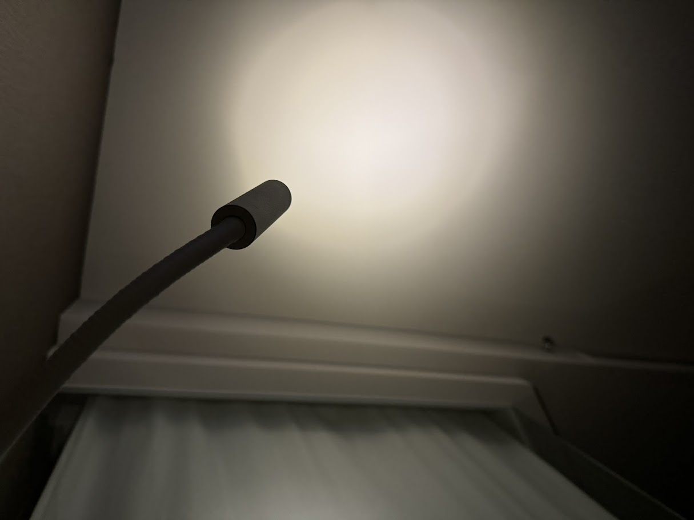
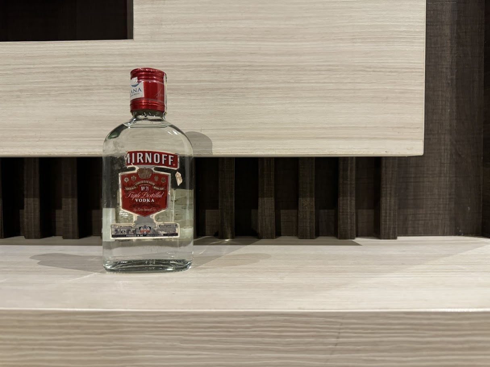
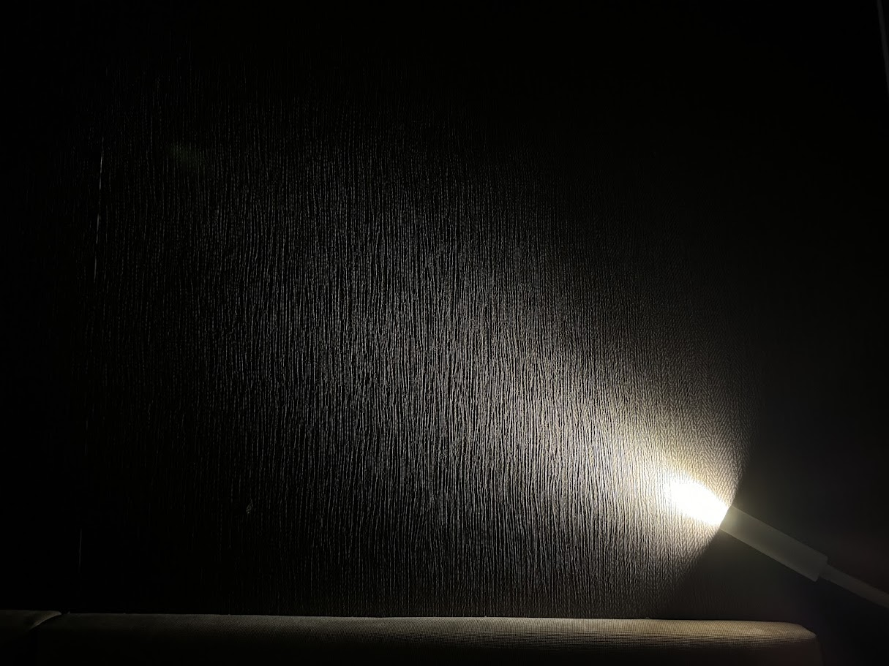
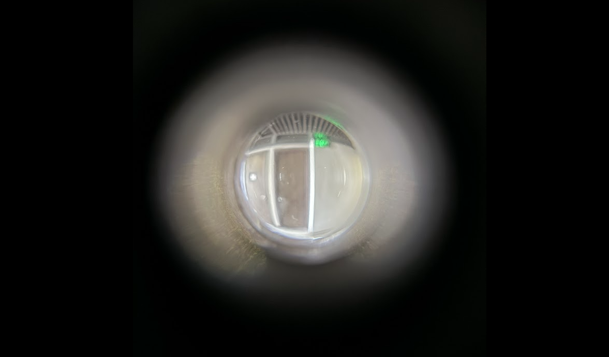

\
\
I had visions.
\
\
\

\
\
Well I didn't, they're just dreams.
\
\
\
Alcohol gives people purpose, squeezes them dry inside out, eventually, keeps their eyes shut. It drags one from shame, repentance, recklessness, insanity to hope, craving, yearning, even wishes of time traveling. The liquid hits the subconscious, stripping away your sobriety, until honesty nakedly reveals, luring out the most vulnerable child within a person, in the most lonesome moments. 
\
\
\

\
\
Alcohol gives me hives, kind of a skin reaction, on the contrary, keeps my eyes open. Starting with a small red area on the skin, the itch starts spreading out my flesh, keeping me from sleeping. Times like that, I became best friend with the ceiling, sometimes a friend doesn't need to say a word, their presence alone can be a solid rock. For most of the nights, I have some inexplicable visions before actually falling asleep. They were all, obviously, unreal, and happened in various ways. One time, I was lost in an infinite staircase, another time, I saw a random childhood friend, then a giant spider, a car accident, a family massacre, and most of the times, a faceless girl. Dreams – there are good and bad ones, some formed from primitive fears, some, are our hidden desires.

Silly, isn't it ? I slapped on my face, tried to wake myself up, but the desire of living in that moment was so powerful, that I forgot this was all fantasy. I got stucked with the blurry image that my naive eyes couldn't even know if it was real, things were so comfy that I pledged to do anything so it could last forever. 

Uncanny experience huh, I must admit. But hey, I'm just being dramatic. Of course these things sound too depressing to be true, but who knows, guys. One day, with your mind being tottering, your sanity being washed away, your pipe dream comes up at last, your deepest craving emerges, that even hurting yourself couldn't wake you up.
\
\
\

\
\
\
How do I say, Morpheus showed up and gave you two pills.

Just, this time, both were red.
\
\
\
\

\
\
*" What is it ?*

*Ah! This night, this carriage, it just feels like a fantasy. It's too good to be true.*

*Why can't it be ?*

*Because tomorrow we're not Anna and David. We're back to reality.*

*Why don't we.. just forget about the reality for one night. And just stay in the fantasy.*
\
\
\
*...I would love that ".*
\
\
\

\
\
One way or another, you will have to pull yourself together. I know these cheesy sentimental things really do add some flavors to your life, to a so-called phase – youth, but making yourself a cripple in a bustling world is not a really wise way. Don't try imitating me, stay sane and forget everything you just read. Everyone is trying to escape from their own misery, why would you try to enter one ? Everyone is racing against time, wrestling with their conscience even in sleep. Everyone is looking for me, unfortunately, so am I.

People have their own ways of rewarding themselves. Fine dining, clubbing, traveling to Southeast Asia, I know a guy who tried to screw whores before the closing ceremony of my last grade in high school. Oh, almost forgot, shopping! Well I love that too, in the two years since my first job, I’ve bought... two shirts. The other shirts I got from attending some online tech events, companies' projects, I even stole trousers from my friend. Hell yeah, didn't expect that did ya. But, I buy stuff, electronic things, keyboards, mice, monitors,... I got my first Strat a few years ago, a Bullet one. March 8, iirc. 

Six days later, I got another bullet,
\
\
\
\
\
\
right through my chest.​
\
\
\
​
<!-- the shed of no return 
rendezvous-->