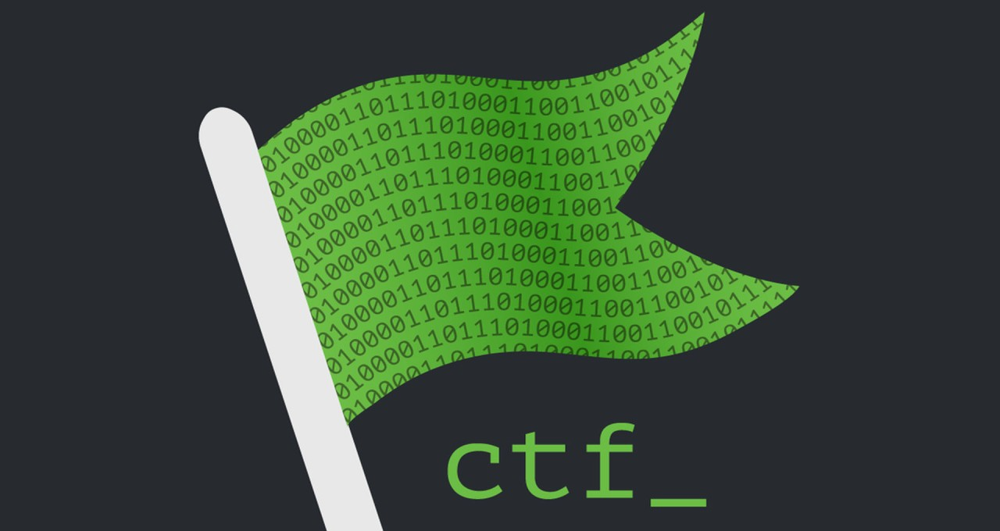
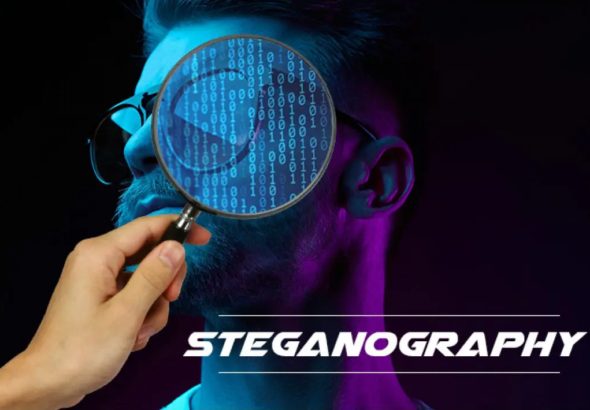
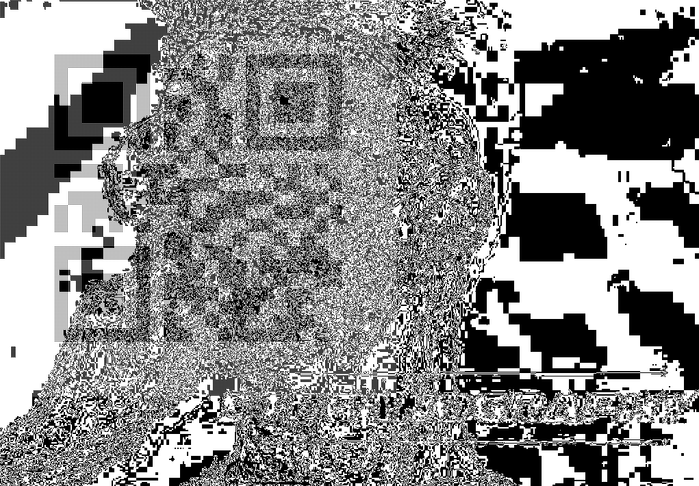
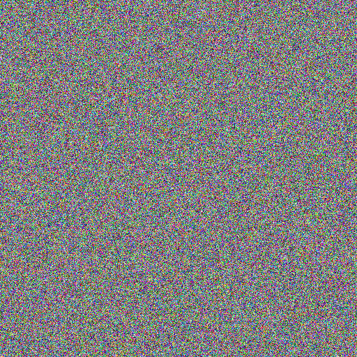
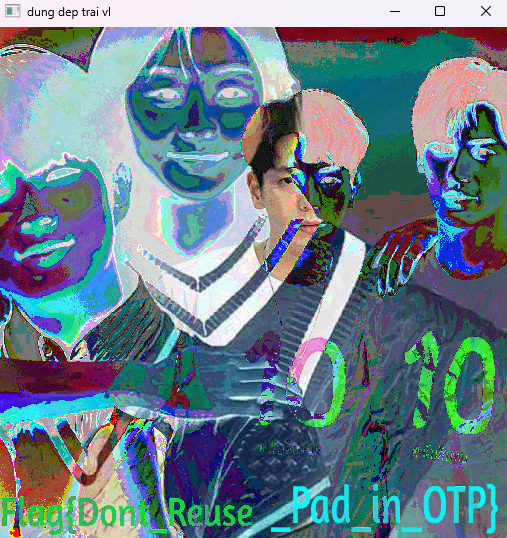

\

\
\
​[**Great eyes**](https://ctf.viblo.asia/puzzles/great-eyes-skspr740euc) [Misc]

Nhấp vô link youtube đính kèm sẽ dẫn đến video dài hơn 5' chiếu đoạn scrolling text (intro của Star War). Cách duy nhất để tìm là ngồi nhìn từ đầu video đến khi flag xuất hiện, lúc 3:20, mù mẹ mắt.

Đm thằng tác giả.
\
\
\
\
\
​[**Fog Of Hidden Mist Village**](https://ctf.viblo.asia/puzzles/fog-of-hidden-mist-village-p6nd8mh8381) [Misc]

Bài này nên được gắn tag Stego.

`encode.py` :   chứa hàm WriteMessage() giúp hide message (QR Code) qua 3 kênh RGB.

`Fog.png`   :   file cuối cùng chứa QR Code đã được blend vào trong.

Mình thử dùng stegsolve bộ Red plane 0, Green plane 0, Blue plane 0 thì thu được 3 QR Code khác nhau, tương ứng với 3 phần của flag.

Ví dụ kênh đỏ:


Nếu giải đúng chắc phải reverse hình qua code được cung cấp. Mình thử scan online ở vài web thì cũng không ăn thua do QR bị lẫn pixel từ kênh của hình gốc. May sao vẫn có một web scan ra được, đỡ phải reverse code, hehe.
\
\
\
\
\
​[**Infinite**](https://ctf.viblo.asia/puzzles/infinite-cm4ue2r7ywx) [Crypto]

`number.txt` : chứa rất nhiều số nguyên có 3 chữ số.

​Số nguyên có 3 chữ số có vẻ sẽ là ASCII. Thêm cái hint nói nhăng nói cuội chả hiểu đéo gì, chỉ để ý đến con số 99. Hỏi con vợ thì bảo cầm lần lượt từng số đi chia lấy dư cho 99 là ra.

```python
message = ''.join([chr(num % 99) for num in numbers])
```
\
\
\
\
\
​[**Jefferson**](https://ctf.viblo.asia/puzzles/jefferson-jommvw8xmus) [Crypto]

`secret.txt` : chứa 19 dòng ký tự gì đấy cùng key và vài con số.

Jefferson có nghĩa là Jefferson's Wheel, là một dạng mã hóa bằng cách thay đổi thứ tự của các đĩa khi stack chúng với nhau. Có thể tham khảo video minh họa: ​[**Jefferson Disk**](https://www.youtube.com/watch?v=FVcSk6TYUI8).

Rất đơn giản, tưởng tượng từng dòng là một chiếc đĩa riêng biệt, trục quay là cái cột ở giữa, chỉ cần sắp xếp chúng theo thứ tự được cung cấp trong `secret.txt`.

```
             ┌──┐                                 ┌──┐
             │  │                                 │  │
             │  │                                 │  │
 1 PAGFZWTHRCQEBKDVLYJXUMOSNI       14 NECDSHAZVLJOI|K|MWTBXPYQRGFU
 2 IFBVXQWOGAYRHZLKPMUSEJCTDN        8 EAJVTQKYWHPXZ|B|IMODGLUCNFRS
 3 APLJBGCZFDVKEOXHMNIRTWSYQU       10 VZYLTSJMXUPDW|E|GHFCQABRNKOI
 4 GPWBNTAURQSHLZIDXKJMYFCEOV       16 EYTMPCZVSJBHN|F|QKRDUXLIAGOW
 5 UCILSPZYXQHABTNREWJFDMOVKG       17 RTYJEPGWIBOZM|C|HVDKULSQFAXN
 6 VKRUSDXBHPFEWLCJIQAOGTZMNY       13 GKYJPDAUBZENT|M|SQWOHRLVCXFI
 7 UASHNVRFXZCQWMLYBDKTJPEGIO        9 OFTQGBMWCVEJY|L|NRDUHSKIXZPA
 8 EAJVTQKYWHPXZBIMODGLUCNFRS       19 NWVXOESHQLZBD|I|MFACJRUGPTKY
 9 OFTQGBMWCVEJYLNRDUHSKIXZPA       18 NGOQYCERTBUZJ|I|MKFAPXLSHDVW
10 VZYLTSJMXUPDWEGHFCQABRNKOI        3 APLJBGCZFDVKE|O|XHMNIRTWSYQU
11 OXAMNVFWQSZCKYEDRPBLGIHTJU        4 GPWBNTAURQSHL|Z|IDXKJMYFCEOV
12 EAYOPURMZGSJDICQBKFNXVTHWL        2 IFBVXQWOGAYRH|Z|LKPMUSEJCTDN
13 GKYJPDAUBZENTMSQWOHRLVCXFI        6 VKRUSDXBHPFEW|L|CJIQAOGTZMNY
14 NECDSHAZVLJOIKMWTBXPYQRGFU       12 EAYOPURMZGSJD|I|CQBKFNXVTHWL
15 YTOBWHUZCKJPLDSMEIXARGQFVN       15 YTOBWHUZCKJPL|D|SMEIXARGQFVN
16 EYTMPCZVSJBHNFQKRDUXLIAGOW       11 OXAMNVFWQSZCK|Y|EDRPBLGIHTJU
17 RTYJEPGWIBOZMCHVDKULSQFAXN        5 UCILSPZYXQHAB|T|NREWJFDMOVKG
18 NGOQYCERTBUZJIMKFAPXLSHDVW        7 UASHNVRFXZCQW|M|LYBDKTJPEGIO
19 NWVXOESHQLZBDIMFACJRUGPTKY        1 PAGFZWTHRCQEB|K|DVLYJXUMOSNI
             │  │                                 │  │
             │  │                                 │  │
             └──┘                                 └──┘
```

Tác giả đã xáo trộn thứ tự của các đĩa, tuy nhiên cha nội này không xoay chiếc đĩa nào mà để im, cho nên nhìn một lúc sẽ thấy key `KBEFCMLIIOZZLIDYTMK` xuất hiện ở cột thứ 14. Nhìn qua bên trái sẽ thấy flag nằm ở cột đầu tiên.

Một ví dụ ngoài lề, nếu tác giả xoay bừa mấy cái đĩa, chúng sẽ trông như bên dưới. Ta chỉ cần align lại rồi dóng qua các cột khác cho đến khi tìm được một message có ý nghĩa.

```
                   ┌──┐
                   │  │
                   │  │
       UNECDSHAZVLJOI|K|MWTBXPYQRGF                              
       VTQKYWHPXZ|B|IMODGLUCNFRSEAJ
       BRNKOIVZYLTSJMXUPDW|E|GHFCQA
       EYTMPCZVSJBHN|F|QKRDUXLIAGOW
       OZM|C|HVDKULSQFAXNRTYJEPGWIB
       UBZENT|M|SQWOHRLVCXFIGKYJPDA
       NRDUHSKIXZPAOFTQGBMWCVEJY|L|
       ESHQLZBD|I|MFACJRUGPTKYNWVXO
       PXLSHDVWNGOQYCERTBUZJ|I|MKFA
       NIRTWSYQUAPLJBGCZFDVKE|O|XHM
       FCEOVGPWBNTAURQSHL|Z|IDXKJMY
       VXQWOGAYRH|Z|LKPMUSEJCTDNIFB
       YVKRUSDXBHPFEW|L|CJIQAOGTZMN
       THWLEAYOPURMZGSJD|I|CQBKFNXV
       ZCKJPL|D|SMEIXARGQFVNYTOBWHU
       XAMNVFWQSZCK|Y|EDRPBLGIHTJUO
       PZYXQHAB|T|NREWJFDMOVKGUCILS
       UASHNVRFXZCQW|M|LYBDKTJPEGIO
       |K|DVLYJXUMOSNIPAGFZWTHRCQEB
                   │  │
                   │  │
                   └──┘
```
\
\
\
\
\
​[**One True Pairing**](https://ctf.viblo.asia/puzzles/one-true-pairing-ke0qayye4kp) [Stego]

`first_image.bmp` `second_image.bmp` : hai file bitmap, cả hai đều noise tựa tựa nhau, trông như dưới đây:



Trông noise như thế nên mình tưởng header của file bị hỏng, thử check bằng Hex Editor thì vẫn nguyên vẹn chứ không bị sửa đổi gì (header của **BMP** là 0x42, 0x4D). Thử dùng stegsolve cũng chẳng thu được gì nốt.

Thử search vài challenge có đụng đến bitmap thì thấy có suggest XOR hai file lại với nhau. Ok search nhanh google tìm code XOR hai tấm hình:

```python
import cv2

foo = cv2.imread('./first_image.bmp')
bar = cv2.imread('./second_image.bmp')

key = cv2.bitwise_xor(foo, bar)
cv2.imshow('dung dep trai vl', key)

k = cv2.waitKey(0)
```
\
Kết quả:


