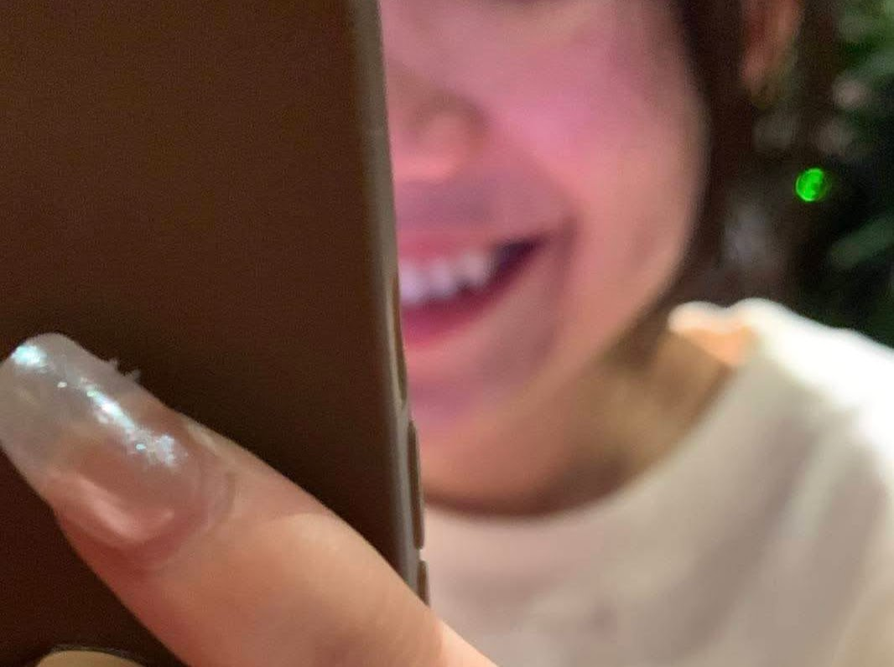

\
​

-- Will be there next week !
​\
\
\
\
Tell me more. A message lit up the screen amid the day. Guessing the sender by the content of the message always intrigues me as I grabbed my phone. Undoubtedly, it was from someone whose name is just merely an emoji of a strawberry. In fact, it's not something that unanticipated, she made that claim a year ago, now is just the time to fulfill it. Pffft, how long could it have been. 
\
\
\
​
**Six years.**
\
\
\
​
Huh ? Tried to clear up my mind, just helped her with the math exercise like yesterday, at a coffee store. Joke's on me, but things just seemed vague.

Gotta see her at this place called Homeland Artists. Knew it! A den of instrumentalists, no offense. Every time I'm at such places, the patrons tend to do drugs, sometimes herb, which can lead to an unexpected out-of-tune voice or strand, a real pain in the arse. I checked the route, knew that I'd been there tens of times, but it was always like the first time. One thing, a performance, a presentation, a reunion, all make me nauseous.
\
\
\
​
-- Your Uber has arrived.
\
\
\
​
She smiled, always works.
\
\
\
​
-- Did you bring the helmet ?
\
​-- Yeah.
\
\
​

Of course I did, who would step on a rake twice. She gave me two large paper sacks, as if it had been years since her last shopping here, well, it is. Call me perverted, but being able to tell a person through scent is kinda my forte, it was carved, six years ago, an indelible mark in the brain. A person, a distinct piece.

Gave her my phone to navigate the route, eventually, it locked itself, so I read her the password. I think we all know where this "navigation" thing is going. As she delved into the conversation, the map on my phone became a forgotten relic, the moment she realized, we were already in a one-way street. Every turn was left to the whims of fate. Right, just wait until I reach the North, then tell me to make a turn, I insist! The girl'd inevitably crack up every time, she hasn't changed much, still lighthearted, and fragile.
\
\
\
​
-- Your password, what do the numbers mean ?
\
\
​
__________________
​
# The Pizza.
​
| Order    | Ingr.                             |
| -------- | -----------                       |
| Pizza    | *half-half*                       |
|          | *mozzarella, parmesan, camembert* |
| Pasta    | *crab tomato cream*               |
|          | *ricota cheese*                   |
| Salad    | *burrata*                         |
|          | *tropical fruit, parma ham*       |
| Dessert  | *passion fruit, strawberry*       |

\
\
​
Took about five minutes of waiting for a vacant table, a few minutes more before we settled down. Gosh, it was just Monday. I asked for some tissue, the waiter right away brought out a new box of forks and knives even before she asked me what was wrong with the old set.
\
\
\
​
-- Nothing, just my dining habit.
\
\
\
​
My apologies, I meant to clean the forks before every meal. That moment, I realized the habit of eating at a regular food store has lingered in my subconscious for quite some time, that cleaning a spoon is a rare sight in a restaurant. Meanwhile, the girl, having no idea what was happening, struggled with her clogged nose because of the local heatstroke. Don't ask me how these two are relevant, that's what she said. I did cough a little bit that day, we were like the kind of people who can get sick at any time. I got a sore throat, she got, a stuffy nose.

Here came the food. The waiter suggested pouring some honey on the smoked mozzarella. The girl heard that, insisted on it, and I did the pouring. She took some first bites, told me it tasted like crap, that it was nothing like the American pizza. Yeah right, like I had ever tried a slice of that bloody foreign pizza in my life.
\
\
\
​
-- Shouldn't you have a girlfriend ?
\
\
\
​
Believe it or not, every time we texted, not regularly, like every few months, that inquiry about my status would inevitably arise, and there she was, bringing it up again. My answer, like usual, was the environment. I mean, come on, I studied electronic stuff, worked in the software world, my social circle mainly consisted of tech nerds, what else could be a better excuse ? Deep down, I think, she wouldn't buy it. I'm sorry, I just don't know how to treat people, at least if I keep myself from them, the world would have less misery. 
\
\
\
​
-- Need a matchmaker ?
\
\
\
​
Bitch please. Look at your goddamn Vietnamese bestie. It was another girl from our secondary school, her relationship status is practically a relic covered in cobwebs, we might need a dustpan before a matchmaker.

We'd been sitting here for too long, if it weren't for the dessert, the waiter might have kicked us out. Took some of her footages, I sometimes wonder how behaviors can change with the culture, but then, she glowered at my camera — an old constant in our interactions.
\
\
\
​
-- Eat more !
\
\
\
​
I, couldn't. I don't even make a habit of having breakfast, I eat most of the time based on my mood, taking my health for granted. She once said many years ago, under the same roof, one must complement the other, if she doesn't eat much, then I have to. "Just try a little more!" - she urged while locking my eyes. I was obsessed with that gesture, a momentary reason that kept me from considering this reunion unworthy. Time surely has its corrosive effects on things, my memory might be failing me, but the feelings never would. My teacher once wrote: 
\
\
\
​
ㅤ *"Each time I see my old friends, I am given a chance to pay a visit to the earlier me's, each different in its own time, each a point of departure for the next, and all of these me's make me me today. Seeing old friends is a form of time travel, a kind less confusing than, say, that in Avengers Endgame. The world is lost and here we are, in this cocoon of isolated time dimension, chatting away."*
\
\
\
​
All of the panacea stuff, turned out to be true.
\
\
​
__________________
​
# The Coffee.
\
\
​
Couldn't find my favourite juice, I then chose a plain coffee.
\
\
\
\
​
We were in the same secondary school, but not the same high school, anyhow we still had plenty of mutual friends, and they had their own choices at the age of sixteen. There was another school, not ours, I don't want to be rude, but the majority admitted that there quite a few social vices here. I told her that all of our friends from there were already in eternal rest, like literally. She scolded me in the face, flicked me in the forehead, obviously, I knew it was her habit with people.

We didn't talk much. For much of the reason, it's because of me — I fear conversations. Yep, you read that right. I'm still working on it, especially when my new manager at work is quite a chatty  guy. Perhaps that's why she tended to stick with the old things, teasing me about how timid I was, what a picky eater I am (which made me skinny), also how tedious my phone is. Well, who needs a phone when a computer would suffice!
\
\
​
Time to bring her back to her acquaintance's place. Great! Just in an adjacent district. She was heavy-eyed, rested her chin on my shoulder a few times from the beginning, hmm, perhaps an affectionate girl type. I love the part whenever I drop someone off, I instantly get back to the journey where I can talk to myself. That, a life practice advice from my teacher, is the only time of the day when I can pull myself together.

I have no idea how I should look at her as I'm trying to find the appropriate way to treat this little girl. Is it like a schoolmate, a childhood friend, or a stereotype oversea Vietnamese ? Ah, silly me, how do I say it, more like an old flame.

The next time she shows up, who knows, maybe a ring on the hand.
\
\
\
​
​

\
\
\
​
-- But hey, what were those numbers ?
\
\
\
​
__________________
​
# The rest.