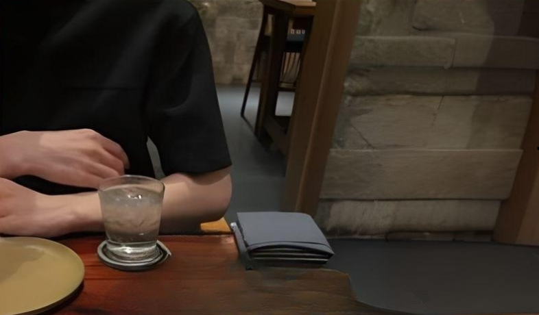
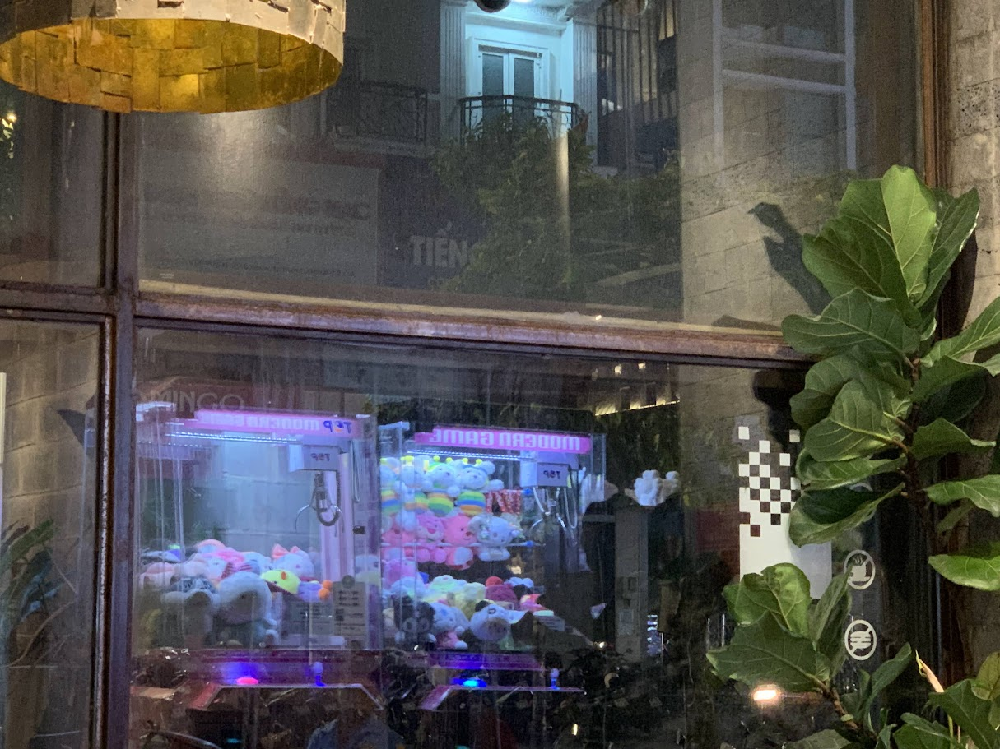

\
​

*"Will be there next week !"*
​\
\
\
\
Tell me more. A message lit up the screen in the midst of the day. Guessing the sender by the message always intrigues me as I grabbed my phone, it was from someone whose name is just merely a strawberry emoji. She made that claim a year ago, now is just the time to fulfill it. Pffft, how long could it have been. 
\
\
\
\
\
**Six years.**
\
\
\
\
\
Huh ? Tried to clear up my mind, just helped her with the math exercise like yesterday, at a coffee store. Joke's on me, but things just seemed vague.

Gotta see her at this place called Homeland Artists. Knew it! A den of instrumentalists, no offense. Every time I'm at such places, the people tend to do drugs, sometimes herb, which can lead to an unexpected out-of-tune voice or strand, a real pain in the arse. I checked the route, knew that I'd been there tens of times, but it was always like the first time. One thing, a performance, a presentation, a reunion, all make me nauseous.
\
\
\
*"Your Uber has arrived."*
\
\
\
She smiled, always works.
\
\
\
*"Did you bring the helmet ?"*
\
*"Yeah."*
\
\
\
Of course I did, who would step on a rake twice. She gave me two large paper sacks, as if it had been years since her last shopping here, well, it is. Call me perverted, but being able to tell a person through scent is kinda my forte, it was carved, six years ago, an indelible mark in the brain. A person, a distinct piece.

Gave her my phone to navigate the route, eventually, it locked itself, I then read her the password. I think we all know where this "navigation" thing is going. As we delved into the conversation, the map on my phone became a forgotten relic, the moment she realized, we were already in a one-way street. Every turn was left to the whims of fate. Right, just wait until I reach the North, then tell me to make the turn, I insist! The girl inevitably cracked up every time, she hasn't changed much, still lighthearted, and fragile.
\
\
\
*"Your password, what do the numbers mean ?"*
\
\
​
__________________
​
# the pizza.
​
| Order    | Ingr.                             |
| -------- | -----------                       |
| Pizza    | *half-half*                       |
|          | *mozzarella, parmesan, camembert* |
| Pasta    | *crab tomato cream*               |
|          | *ricota cheese*                   |
| Salad    | *burrata*                         |
|          | *tropical fruit, parma ham*       |
| Dessert  | *passion fruit, strawberry*       |

\
Took about five minutes of waiting for a vacant table, a few minutes more before we settled down. Gosh, it was just Monday! I asked for some tissue, the waitress right away brought out a new box of forks and knives even before she asked me what was wrong with the old set.
\
\
\
*"Nothing, just my dining habit."*
\
\
\
My apologies. I meant to clean the forks before every meal. That moment, I realized that the habit of eating at a regular street food stall has lingered in my subconscious for quite some time, that cleaning a spoon is a rare sight in a restaurant. Meanwhile, the girl, having no idea what was happening, was struggling with her clogged nose because of the local heatstroke. Don’t ask me how those are relevant, that's what she said. I did cough a little bit that day, we were like the kind of people who can get sick at any time. I got a sore throat, she got, a stuffy nose.

Here came the food. The waitress suggested pouring some honey on the smoked mozzarella. The girl heard that, insisted on it, and I did the pouring. She took the first bite, told me it tasted like crap, that it was nothing like the American pizza. Yeah right, like I had ever tried a slice of that bloody foreign pizza in my entire life.
\
\
\
*"Shouldn't you have a girlfriend ?"*
\
\
\
Believe it or not, every time we texted, not regularly, like every few months, that inquiry about my status would inevitably arise, and there she was, bringing it up again. My answer, like usual, was the environment. I mean, come on, I never step an inch out of my house, even my neighbors see me by luck. I studied electronic stuff, worked in the software world, my social circle is mostly a bunch of tech nerds, what else could be a better excuse ? But deep down, I think, she wouldn't buy it. I'm sorry, I just don't know how to treat people, at least if I keep myself from them, the world would have less misery.
\
\
\
*"If only I were handsome, I would have one."*
\
*"If you're not, who is !"*
\
\
\
Wouldn't I love to have that printed on my T-shirt. But let’s be honest, those days when I got attention from ladies have gone, compared to any other guys in her circle, I wouldn't stand a chance. That's totally fine, even a bit surprised when we still hung out, tho. She seemed intrigued, but not sold with the fact that I'm still single, teasing me while giving questioning eyes.
\
\
\
*"Need a matchmaker ?"*
\
\
\
Bitch please. Look at your goddamn Vietnamese bestie. It was another girl from our secondary school, her relationship status is practically a relic covered in cobwebs, we might need a dustpan before a matchmaker.

We'd been sitting here for too long, if it weren't for the dessert, the waiters might have kicked us out. Took some of her footages, I sometimes wonder how behaviors can change with the culture, but then, she glowered at my camera – an old constant in our interactions.
\
\
\
*"Eat more !"*
\
\
\
I, couldn't. I don't even make a habit of having breakfast, I eat most of the time based on my mood, taking my health for granted. She once said many years ago, under the same roof, one must complement the other, if she doesn't eat much, then I have to. "Just try a little more !" – she urged while locking my eyes. Oh dear, I was obsessed with that gesture, a momentary reason that kept me from considering this reunion unworthy. Time surely has its corrosive effects on things, my memory might be failing me, but the feelings never would. My teacher once wrote: 
\
\
\
ㅤ *"Each time I see my old friends, I am given a chance to pay a visit to the earlier me's, each different in its own time, each a point of departure for the next, and all of these me's make me me today. Seeing old friends is a form of time travel, a kind less confusing than, say, that in Avengers Endgame. The world is lost and here we are, in this cocoon of isolated time dimension, chatting away."*
\
\
\

\
\
Time to leave. She put on the helmet, buckled it up herself. 
\
\
\
Kinda weird when I let her decide where to go for a drink. I know it's not a typical move, especially for a girl, but bad news for her because she was with me – a 'stay-at-home' guy. Anyway, there we were, at a coffee store right by a roundabout. Couldn't find my favourite juice, I then chose a plain coffee.

We were in the same secondary school, but not the same high school, anyhow we still had plenty of mutual friends, and, they already had their own choices at the age of… fifteen. There was another high school, not ours, I don't want to be rude, but the majority admitted that there were quite a few social vices here. I told her that some of our friends from there were already in eternal rest, like literally. She scolded me in the face, flicked me in the forehead, obviously, I knew it was her habit with people.

We didn't talk much. For much of the reason, it's because of me – I fear conversations. Yep, you read that right. I'm still working on it, especially when my new manager at work is quite a chatty  guy. Perhaps that's why she tended to stick with the old things, teasing me about how timid I was, what a picky eater I am (which made me skinny), even how tedious my phone is. Well, who needs a phone when a computer would suffice !

Time to bring her back to her acquaintance's place. Great! Just in an adjacent district. She was heavy-eyed, rested her chin on my shoulder a few times from the beginning, hmm, perhaps an affectionate girl type. I love the part whenever I drop someone off a lift, I can instantly get back to the journey where I can talk to myself. That, a life practice advice from my teacher, is the only time of the day when I can pull myself together.
\
\
\
*"But hey, what were those numbers ?"*
\
\
​
__________________
​
# the Ticos.
\
*"Want some snail dishes ?"*
\
\
\
Thought these types of food had already vanished from her menu. I opted for a spot that I pass by daily on my way home from work, coincidentally, quite near from our secondary school. She asked me to make some orders, sure, let me serve up a feast, how hard can it be !
\
\
\
*"We have a menu here ?"*
\
*"You are looking at it."*
\
\
\
The lady pointed toward a bunch of square baskets filled with hundreds of scallops, oysters, clams, sweet snails, mussels, you name it. That's not even the hard part, there were dozens of different condiments that can be grilled with: scallion oil, fish sauce, honey, cheese... In the vast sea of possibilities, I found myself adrift, the potential combinations were  innumerable. Dang it, am I here to solve permutation problems !?

After ten minutes of mind struggling, I finally reached the end of the order with... three dishes, which I didn't even remember what they were. I think the girl might be questioning my choice, made a goddamn distinct sigh while inquiring about what I had ordered. My dear, I had to use every of my last brain cell to figure out the fittest combinations among these sea creatures. 
\
\
\
*"Do you really live here ?"*
\
\
\
Bitch started to give me a deadly doubtful eye as if she'd been living here longer than I have. Tsk, guess I had to let the pro do the job. She then went straight to the grill, getting into an endless speech with the lady, not even forget to show me the literal menu coming out from the middle of nowhere. Jeez, do I really live here ?
\
\
\
*"Having an interview this midnight."*
\
\
\
Like, for real ? We were just dining for less than five minutes. Her internship finished a few months ago, the company didn't come up with a return offer in her current scope but a different position in a different field, are you shittin' me ? Well then, a job hopping was likely the right choice. She told me how her life perspective has changed over the last few years, I told her how my front teeth were cracked in my teenage years. Nostalgic, isn't it ? I was quite full, but still tried to eat a bit more as remembering her words from last time. As the bill was paid, we again, headed to a coffee store.
\
\
\
Time to leave. I put on her the helmet, she buckled it up herself.
\
\
\
This place looked... enormous. Have never seen a door three times taller than me, incredibly heavy by the way, is everyone Hulk now ? First thing that caught my eyes, was a shelf full of tiny sculpture waiting to be painted, placed right at the entrance. A smaller shelf was right beside, piled with the finished ones. Question is, aren't they supposed to get home with the owners ? Or maybe the result was so bad that they didn't even want to bring them home ? So many cool sculptures here: Kakarot, Thanos, animals that don't look like animals... But of course, the cutest one, a kitty, grabbed her attention. Uh oh, look like I spotted something.
\
\
\
*"Come take a look."*
\
*"Oh come on !"*
\
\
\
There was pity in her eyes, a small crack marred the ear of the kitty, yet in the end, she still chose it, no matter this could lead to the inevitable fracturing during the painting process. This, left me to think: Some people overlooked all possible mistakes simply because the other person possesses the one thing they desire. They are not even the protagonists in their own stories, like there is an invisible eraser imperceptibly wiping away their ego. Everything will be rotten, that person will eventually vanish from their life, leaving behind a hidden wound, as if nothing had ever happened. Okay guys I know, it sounds overdramatic, but, come to think of it, have you ever witnessed such situation in your life ?

We took some colors in liquid state – not sure what to call it – and needed to find the rinse water somewhere. So weird, that was like the second most important thing after the colors, yet I couldn't find its existence. I noticed that everybody had themselves a small plastic cup filled with fresh water. How was this even possible, where did that water come from, I was just asking for music in a dance class. Losing my patience, I then approached an employee.
\
\
\
*"You can take it in the restroom."*
\
\
\
That's... concerning. I’m pretty sure not everyone here got in the queue to the toilet just for that holy water, could have started a war. Thank god one of the baristas let me take the water from her secret mug, no idea where that came from. We had two soft flat brushes, a small one for painting the details, a medium one for the speedrun. 

We, didn't talk much, of course. Time was slowly ticking, the more we painted, the more fragments from the crack fell out. Was that my thought making sense ? That the rot is spreading, an imminent decay is sneaking, that when you realized, everything has already been irretrievable.
\
\
\
*"Want a teddy bear ?"*
\
\
\
Uh... why did I say that. There are some of the actions I'm pretty sure people somehow experienced without even know they are doing it, which are, unconscious behaviors, I believe. And look at that, a claw machine. 

Ever had the feeling of being observed ? *Psychic staring effect*, that's how it's called. And yes, one of the baristas was literally standing there, three steps away, staring at me for like eternity with the most cringe-worthy smile I've ever seen on the planet Earth. He murmured, that some of the employees tried to nudge the machine, as I saw a few minutes ago, attempting to push the teddy bear into the hole without even touching it.

I was... confused. The heck, what do you want me to do, man ? Was that a hint, or a threat that if I dared to try what he had just said, he would bang the coffee tray on my head.
\
\
\
*"That strawberry bear looks adorable !"*
\
\
\
That, was a Lots-o'-Huggin' Bear, except the fact that it was the size of half of me, I would run out of money before laying my hands on it. I casted my eyes around, and boy, there it was, a little pinky teddy, much like the sculpture we just painted, sorry babe, but this should be an easier target.

Here we go, let's impress the world. Took me like centuries to ensure that the claw was perfectly centered on the teddy's body, just a few inches away before I could aim for the prize. That was until the claw automatically went down itself without me pressing on the button. Wait, what ? There was a timer for this. Argh! I should have known.
\
\
\
*"Give it a try ?"*
\
*"Sure."*
\
\
\
What do you expect ? Of course she missed it. But, such attempt would drag the teddy closer to the hole, its head laid just right on the edge. And I knew, it was my lucky day.
\
\
\

​\
​\
\
Look at this cutie pie holding the teddy bear! Was that something engraved in my mind, that I craved at the moment I laid eyes on those machines, something that used to calm my inner child, years ago, brought me to the Garden of Eden.
\
\
​
__________________
​
# the Butterman.
\
*"My eSIM card got locked !"*
\
\
\
It was the day when she stepped off the plane, guessed she purchased that eSIM at one of the telecommunication booths at the airport. Thing worked just fine for the first month, until it didn't. She had no choice but making a call to the network provider. The operator asserted that her SIM card was a... physical one, that it had already been occupied by someone else. Fantastic, I'm pretty sure my dog has more faith in humanity than she does now.
\
\
\
*"Look at my nails !"*
\
\
\
Uh... sure. I bet she changed her nails no less than three times in the past month. Looking good anyway, just transparent nail polish with some rhinestones, simple, but elegant. Everything was great, except the process took like... three hours. Yikes, smelt like a bad life choice.

Remember when I mentioned social vices at a random high school ? Turns out, those even happened in our secondary school. She told me one of the girls, her friend of course, had confronted a mugger on the street. After minutes of fighting back, she somehow caught a glimpse of the mugger's identity, shockingly, the guy was a classmate! I chuckled. Holy cow, whether to be surprised or to put on a sympathetic face for his path, I might reserve a seat in hell.

This place used to have only one single branch when she was still around, located in another district where she loved to wander, even though it was miles away. Cookies, cupcakes, even the chairs, everything edible here is so sweet, tiny, and sparkly. I guess that would explain why most of the guests here are girls.
\
\
\
*"Yummy! Is this a mochi ?"*
\
*"Marshmello, you silly !"*
\
\
\
Being seduced by a smile, so that's how it is.
\
\
\
We headed to a grill house. There was a group of people, pretty sure they're colleagues at work. I shuddered, as flashbacks raced through my head, like I was on the battlefield with a fleet of alcoholics, which needless to say, are my colleagues. Over time, whenever people call for a toast on the table, I tended to avoid the act of drinking. All I did was clink glasses, shout some cheers and... keep eating. Nice strategy, don't you think ? Beer and I aren't on the same team, I got something called alcohol intolerance, which can leave me itchy for the next whole week, like being exiled to inferno.

Oh ? She got a tattoo. Those ink marks just grabbed my attention while we were waiting for a vacant table at the reception. It was her parents' birthdays, perhaps it had been there for a while, now faded and slightly blurred, bears the marks of time. She called some crab cellophane noodles, that's fine, and then some oysters with lemon slices, then, some cold pale shrimps. The thing is, they were all raw ! 
\
\
\
*"Eat ! You're not gonna die."*
\
\
\
A big doubt here. We just ordered the formula to glue my miserable ass to the goddamn toilet. Not even the worst case, only God knows that I might end up with a prolonged erection, we had a tribe of oysters being served! Does everyone here have a gilded stomach ?
\
\
\
Time to leave. I put on her the helmet, buckled it up myself. 
\
\
\
A coffee store again, obviously. She brought out her Mac, surfing LinkedIn for jobs. If she failed to find one before her flight back, she might consider applying for the postgraduate education, maybe in mathematics or cybersecurity specialization, both were in the data field. What a neat move. If you can't get a job, get a Master's!

I was at a loss for what to do during this, but being surrounded by this atmosphere drew me back to one thing I always ponder. How do people find it easier to concentrate in places like these ? Indistinct chatter, expensive drinks, smooth background jazz, a time-bomb reminder to leave after 11 P.M – all of that in return for something called the ultimate concentration ? One of my friends used to assert that only a professional ambiance brings high efficiency and productivity. Dude, there's a fvcking coconut on the table next to me!
\
\
\
*"​Your hair grew !"*
\
\
\
She sounded... excited while saying that. Been three weeks since our second meet. Maybe from the inside, the image of the old me just crossed her mind ? I got my hair cut since my internship, not for any reason, mostly for the comfort. I don't remember how I looked when I reached puberty, only knowing that at the age of fifteen, the day she came, my circle got broader. Lots of attentions were drawn in, even by girls whose names I had never heard of. Oh come on guys, let me brag for a bit.
\
\
\
*"Gonna have it cut next week."*
\
*"Don't you dare."*
\
*"Thought I won't see you anymore after this."* , I hesitated.
\
\
\
*"Still a chance for one more date."*
\
\
\
Quite touching, to be honest. I used to be good at keeping a poker face, but over the years, that ability died down, I don't like it, but not hating either. Since university, I became more ill-tempered, gradually, tended to shut myself out, just to prevent people from seeing my emotions exposed. There are only a handful of times when I was being honest with myself, when words from people genuinely touch my soul, keeping me from suicidal thoughts. She was like, turning on an intangible switch inside me, pulling me out of the monotony of life. Felt like having something to cling to after a nine-hour shift, felt like the moment she promised to lend me a book nine years ago, felt like I was stepping into a time machine.
\
\
\
\
\
\
\
\
\
\
\
Felt like, a kid in a candy store.
\
\
\
\
\
\
\
\
​
​
<!-- ___________________

# The rest.
\
I had no idea how I should look at her as I was trying to find the appropriate way to treat this little girl. Was it like a schoolmate, a childhood friend, or a stereotype oversea Asian ? Ah, silly me, how do I say it, more like an old flame.
\
The next time she shows up, who knows, maybe a ring on the hand.
\

