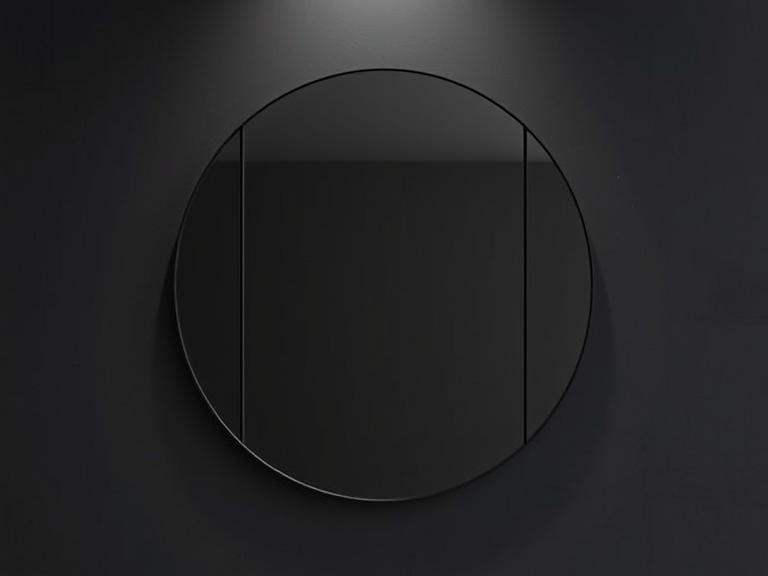
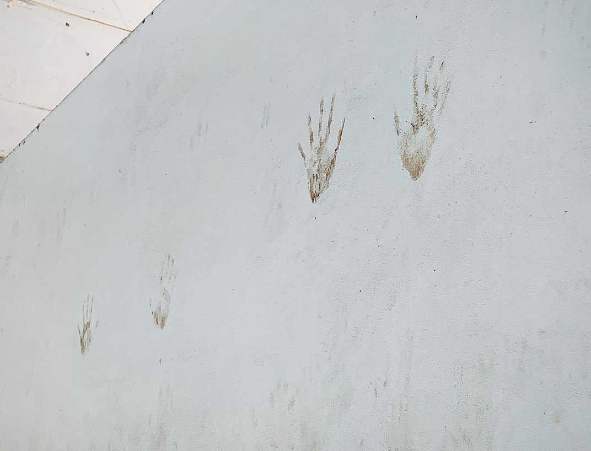

\
\
The same song, the same volume, the same dull ceiling staring back at me. I got up, got dressed, went to work. The fluorescent lights hummed. The keyboard clicked. The same faces nodded at me, exchanging words that no longer hold meaning. Went home. Ate. Slept.
\
\
\
Then woke up again.
\
\
\
Nothing changed. Nothing shifted. Days blurred into each other, time looping around like a snake swallowing its own tail. I started questioning if I ever made a choice, or... if choices were ever mine to make. Til one night, when the air felt heavier, and the shadows stretched just a little too long. A voice, neither friend nor foe, spoke from the corner of my dimly lit room.
\
\
\
*"You’ve noticed, haven’t you ?"*
\
\
\
Am I... stuck ?

A loop. A cycle.

A maze with no walls. 

A prison with no bars.

I had been here before, over and over again. The memories flooded back. 

The walking.

The searching. 

The endless wander.

A figure stepped forward, shrouded in something darker than the night itself. Not human, not quite a monster. A daemon ? A genie ? Whatever it was, it watched me with something between pity and amusement. Two choices, either breaks the cycle or stay here forever, convincing myself that tomorrow will be different.

But, you and I both know, tomorrow is just yesterday, dressed in a new lie. 

The footprints on the floor that matched my own. I didn’t remember how I got here. Because I never left. The daemon smiled, and in its shifting form, I finally recognized the face.
\
\
\
**Mine.**
\
\
\
Go look in the mirror, what's in it ?
​\
\
\

\
\
Nothing, even a silhouette. What are we staring at ? A restrained robot, a hollow vessel, a soulless corpse, a fractured mannequin, or perhaps, you.
\
\
​
__________________
​
# a bet.
​
\
\
I make a habit of writing, yet I don't have plenty of drafts, not because I'm some kind of a disciplined person, but much like how I only find solace in befriending words when the daily mayhem randomly kicks in, which, doesn’t usually happen.

I get easy to stuck in the loop of thought of uneccessary stuffs. I had a Korean colleague, the name – Jaemin. He's young, seems like a hectic person. One time, I was aksed to do some straightforward coding stuff, but rather go straight to the implementation, I chose to find out what the heck these functions specifically do, which, apparently wasted so much of time. Jaemin was a little upset, told me that we were not in a university, there's no time for the dissect things. It's like when someone tell you to find a way to drive a truck, instead of reading the driver handbook, you tried to comprehend the principle of the combustion engine.

The toilet in my office. Month after month, within four walls smaller than three square meters, every morning, I rooted there for nearly an hour, eating my sandwich, leaning my head against the wall and couldn't cry my eyes out. But I wasn't at home, I had work to do, I had to get a grip on myself. Jaemin was right, this isn't a university, nor a kindergarten so I can shed my tears.
\
\
\
\
\
\
\
(don't know what to put in this part yet)
\
\
\
\
\
\
What's the catch here ?
\
\
\

\
\
People.
\
\
\
When the time comes, you will have to leave, every single one of them. Yes, I'm being selfish, and making a fuss, my words sound like I was the protagonist of some ridiculous unscripted movie. Live long enough and you will start to realize people's vices. Words, beliefs, even their misconceptions that have lingered in your brain long enough, you’ve mistaken theirs for your own. Ever wonder how their words have chained you to this loop, for this whole time ?

You don't need more time, you just need to decide. Yes, then do it. I will do it, thousands of time telling myself I wouldn't not let this chance slip away, knowing that when I open this door, will be the shed of no return. Take it or leave it, there is not much time. My cognition was thousands of miles apart, my body was falling into the abyss, but I must pull myself from the chaotic frame of mind. Because I knew, even the slightest attempt, at any price, has to be made.

The next time you find yourself stuck in a loop, at all costs, find the spot. Like a glitched spot in an arcade game, when Vanellope drove in reverse then took a hidden underground route, observing every single one of the opponents, items, shortcuts, even deprecated characters. One step backward and the spot shall appear, either you are sober enough to seek for it, or remain chained to the delusional effort, til the concept of time rots away. People have themselves someone who keeps their mind from straying, even if that person is no longer with them. Others carry an inseparable thing in their bag, like Cobb's totem. Mine ? A knitted amulet.
​\
\
\
\
\
\
\
\
\
\
\
\
\
\
\
\
\
\
\
\
\
\
\
\
\
\
\
\
\
\
\
\
​
___________________

*"I thought I could bring an end to the world's suffering.*
*But when every equation was solved, all that remained, were fields of dreamless solitude.*
*There was no prize to perfection. Only an end to pursuit.*
*In all timelines, in all possibilities, only you...*
\
\
*can show me this."*
___________________
​\
\
\
\
\
\
\
\
\
\
\
\
\
\
\
\
\
\
\
\
\
\
\
\
\
\
\
\
\
\
\
\
The footprints on the floor that matched your own. You didn’t remember how you got here.
​\
\
\
\
\
\
\
\
\
\
\
\
\
\
\
\
\
\
\
\
\
\
\
\
\
\
\
\
\
\
\
\
​
Because you **never** left. 
\
​
<!-- All of the panacea stuff, turned out to be true.

万能薬

Jackson Wang:   Okay let me rearrange my words.
Kole        :   You can rearrange something else. 

Do not cite the deep magic to me, I was there, the day it was written.
Maybe I don't trust myself, but I trust the processs.
with great power comes great electricity bill
uh , Control-Alt-Delete, I guess ?
everything everywhere all at once
again, just, come to your senses
that's the neat part, you don't
You were there, flesh and bone
Let's teach fish how to swim
you don't see that everyday
things happen for a reason
My theory, it has holes
what's the catch here ?
let's keep it this way
to infinity and beyond
in the nick of time
get the job done
here's the catch
vestige of hope
give me a break
bridge that gap
to amount to
drive insane
nothingness
scintillate
tranquility
hear me out
rendezvous
Valhalla
trippin'
figment
starred
nemesis
do-over
cynical
snuggle
gossip
sedate
remedy
unjust
agony
convo

the person we most want to meet is actually our younger selves

"Your eyes are fading
I’m contemplating letting it all die
Hardwired to failing
A tainted love."

Extroverts always want the introverts to talk more, yet no one is telling the extroverts to shut the fvck up. 
Anh đón gió đêm, làn gió đó thổi qua em. Như vậy có tính chúng ta ôm nhau không

柔弱
最後の砦

steins;gate ep 21

あのね最近怖い夢ばっかり見るんだ
夢の中でねいつもまゆしぃはひどい目に遭うの
ピストルでパンて撃たれたり
車の事故に巻き込まれたり電車にひかれたり…
まるで本当のことみたいで
すっごく怖くて痛くて
悲しくて…
誰か助けてって一生懸命声出すんだけど
出せなくて…
どうしてそんな夢見るのかな？
でねその夢の最後には
いつもオカリンが助けに来てくれるの
まゆしぃは｢オカリンありがとう｣って言うんだけど
その声もオカリンには聞こえなくって
まゆしぃのこと抱きしめてとっても悲しそうな顔をして
絶対泣かないんだけど一生懸命我慢してるのが分かるの
だからまゆしぃも
｢ごめんね｣って言うんだけど
声はやっぱり届かなくて
目が覚めるの
-->