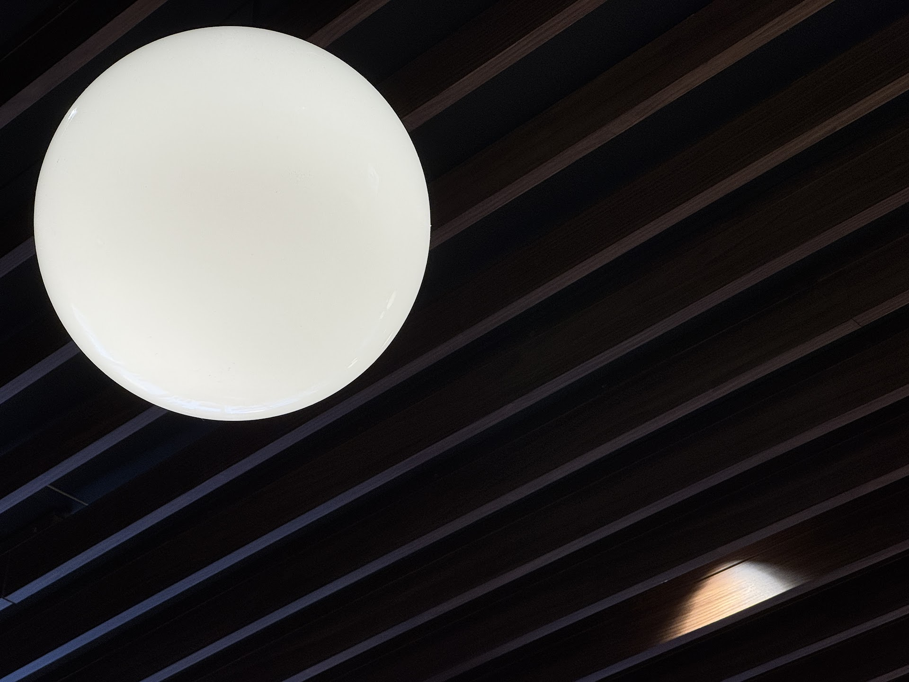
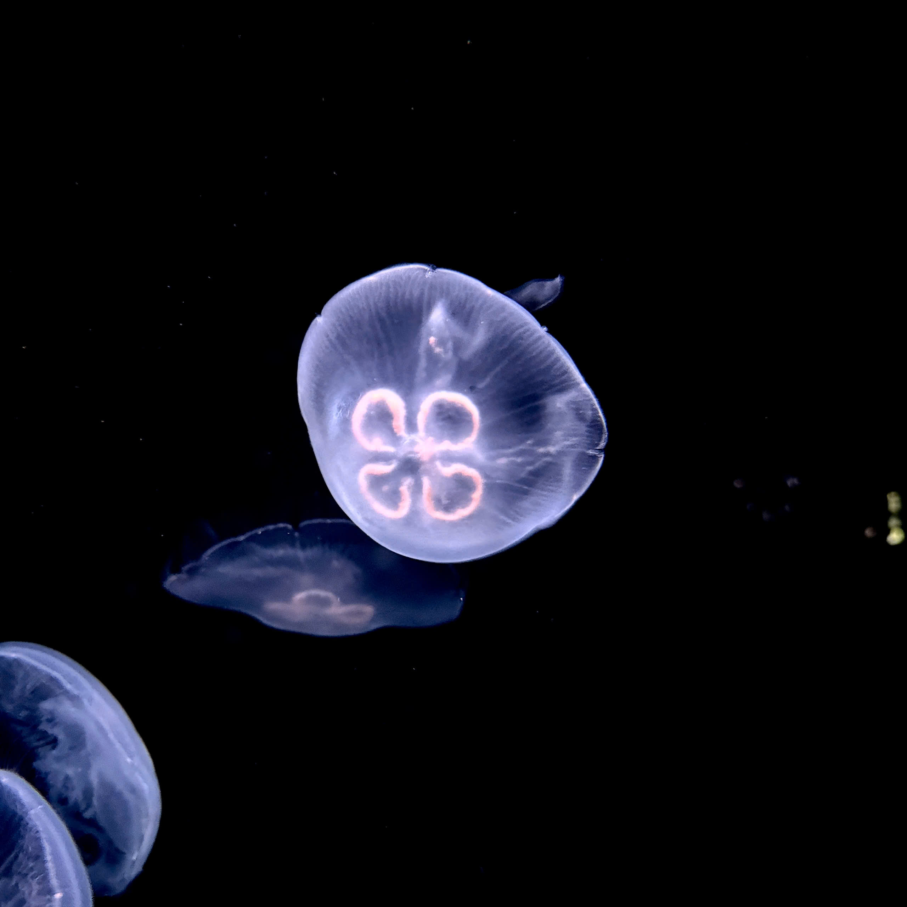

\
​

*"Shall we ?"*
​\
\
\

\
​
__________________
​
# the roastery.
​
\
\
\
She only slept for about an hour yesterday.
\
\
*"I got an 8..."*
\
*"Wasn't that bad, tho ?"*
\
\
\
*"...out of 100."*
\
\
\
Now that's the girl I know.
\
\
\
*"Nice dress, looks like a... curtain !"*
\
*"Yours too !"*
\
\
\
Ha ha, how did she even remember ? Right, it was the time when we were at a highschool festival
I was once forced to sit in the front desk by my English teacher, just because I couldn't shut my yap with my classmates during her class. If she moved me there so that I could focus on the lesson, then yeah it was going nowhere. Every time 
\
\
\
I hit on her knee *"Ouch !"* impotent smile 
\
\
\
Easy peasy, just... wait a moment so that I could look it up in the dictionary. Alright, let's do it. Wait, where did she go ? The girl spoke english to the waiter but he was... confused ? Haven't I told you that this would not work here ? 
\
\
\
*"Her son, omg he looks exaclty just like her !"*
\
\
\
Thank you, Captain Obvious.
\
\
​
__________________
​
# the crossing.
​
\
\
*"Do you even live here ?"*
\
\
\
Can't believe I'm once again being asked the same question, in the place where I had lived longer than she had, the second time ! Bitch just came here yesterday but already mastered every station in the country. Jeez, do I even live here ?

​\
\
\
*"There's an empty seat, behind you !"*
\
\
\
I know, and I did hear that very clearly. She again gave me that smiling frown after I just kept "Huh ?" to her. Yes babe, I knew there were seats behind me, it's just, I wanted to look at you a little more, before this train lets go of us, before this place becomes just another memory.

\
\
\
*"Guess how much this hair clip is ?"*
\
\
\
Either it was ridiculously cheap or ridiculously expensive, otherwise she wouldn’t be this excited, wearing that Asian‑mom‑just‑won‑a‑bargain face.
\
\
\
*"I would say... $2 !"*
\
*"Nahh."*
\
*"So $200 then ?"*
\
*"It's $20 !"*
\
\
\
Great, right in the middle. How unlucky I was !
\
\
\
*"But why are you asking me that ? Any special story behind it ?"*
\
\
\
There was a girl, she started, due to an accident, the teeth of the hairclip had pierced that girl's skull. After that, a female engineer came up with an idea of making clips from a flexible material, that even if you lie on it, it should make no harm to your skin. There was a little spark in her eyes, the gentle way she brought up the story really moved me for a moment. She felt the weight of what the engineer did, and I felt the weight of her feeling it. People soften when they hear that something gentle was born from something tragic. I mean, sure, there are people who took every mistake, every loss, every step they'd been through, silently turn it into something that could save the next person they care about, like the way Tony added a parachute to Peter’s suit after watching Rhodey fall in the past.

I urge of being praised, fear of being scolded. I'm not that 

that face of kids telling their parents how they got praised in art class

The type of people who can speak but cannot hear, is a stereotype of saying crap, which is, me.

The waiter brought the wrong set, said something in Japanese. The f he’s saying, forget it, I didn't care, just kept getting along with his words and hoped that he better went a way quickly before I 

The meat is deep-fried, so soft that it can melt in my mouth

Motherf I knew it. 

\
\
\
*"What are you doing ?"*
\
*"Looking at you."*
\
\
\

\
If this isn't nice, what is ?
\
\
​
__________________
​
# the Bark.
​
\
\
*"Here, have some chocolate."*
an お守り.
\
\
*"Know how I know your adress ?"*
\
\
\
The day before my flight, some cookies from the Butterman reached me.
\
\
​
__________________
​
# the aquarium.
​
\
\

Oops, no Apple Pay here. She then fed in a 10,000￥ and received... ten of 1,000￥ in return. Okay what's going on here ? I guess the author of this software was giving us some other chances, that, only "straight" money is accepted. Geez, is money being gender discriminated now ?
\
\

This jellyfish tank, isn't it a little... blurry ? I’m starting to think it might be a video playback.

There's something in the air that kept me from keeping my head clear, the aquarium’s quiet lullaby, I guessed. Five couples sit on the benches, lost in the glow of the jellyfish, soaking in the ocean’s love story like it’s meant just for them.

Hold on, an iguana ? Fascinating. I believed this place would fill me with the ease of the ocean, and this little shit here wasn't even in the water but hanging his ass on a damn tree.

Let's be honest, we all know who this fish looks like.
\
\
\

\
\
\

While living at the Marine Life Institute, a young Dory accidentally strayed too far from her parents and was swept out into the open ocean by a strong current. As she drifted further away, her innate short-term memory loss made it incredibly difficult for her to remember where she came from or how to find her parents. Over the years, her memory limitations caused her to wander aimlessly and forget details about her past, which eventually led to her crossing paths with Marlin, finding Nemo.

Huh, 
\
\
\
\
\
\
\
I...
\
couldn't hold it anymore. 
\
\
\
\
\
Am I... waking up?
\
\
\
\
Like a baby whose toy was taken away, but why it had to be this way, why..., why could I not stop my silly self from crying out like a kid. Which is the face I hate the most. These stupid sentiment are not listening to me, Just 
please, please don't come and wake me up.
\
\
\
\
\
\
\
\
\
\
\
Panacea, does it even exist ?

For a very, very, very long time, I've been searching for such remedy, a "cure-all" for the inner

I'm not sober enough to stay in this world.

Maybe when that day comes, I hope you guys know that, every single person that has stepped in my life, even the slightlest interaction, even the shortest conversation, had kept me from the thought of not straying away from this world, so far.

But 出会い

Oh I see what you did there you little shit.

maybe , maybe in another life, that we could have each other.

<!-- ___________________

*" 堀さん、それ*

*「どこ行くの」じゃなくて、「行かないで」じゃないかな。"*
___________________

堀さん　それ
「どこ行くの」じゃなくて
「行かないで」じゃないのかなあ
どこ行くの?
どこにも行かないよ
「お前なんかいらない」って
「顔を見るのも嫌だ」って
「どこかへ行ってしまえ」って
堀さんがそう思わない限り
俺はここにいるけど
うん
後でちゃんと水分摂らないとね -->

<!-- ごめん ボーッとしてた
大丈夫？
ボーッとするほど 何考えてるのよ
う～ん
いろんな… いろんな偶然が
重なって 今があると思うと
ひとつでも欠けたら
違う世界もあったのかなって
ふ～ん
だとしたら
今 こうして一緒にいることに
運命みたいなものも
あるかもしれないわね
そうかも
きっと私たちは どうやったって
出会ってしまうんだ -->